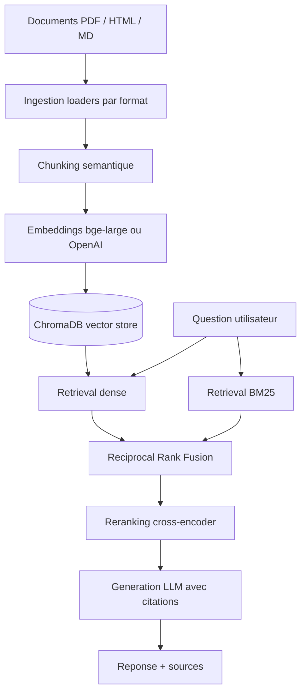

# RAG Portfolio — pipeline hybride avec reranking et évaluation quantifiée

📄 **[Pourquoi ces choix techniques ?](docs/DESIGN_CHOICES.md)** — la partie
la plus importante de ce repo : la justification de chaque décision
d'architecture (chunking sémantique, retrieval hybride, RRF, reranking,
évaluation).

## Ce que fait ce projet



## Stack

| Composant       | Choix par défaut               | Alternative supportée |
|-----------------|---------------------------------|------------------------|
| Embeddings      | `BAAI/bge-large-en-v1.5` (local)| OpenAI `text-embedding-3-large` |
| Base vectorielle| ChromaDB (persistant, local)   | — |
| Retrieval sparse| BM25 (`rank_bm25`)              | — |
| Fusion          | Reciprocal Rank Fusion          | — |
| Reranking       | `cross-encoder/ms-marco-MiniLM-L-6-v2` (local) | Cohere `rerank-english-v3.0` |
| Génération      | Claude (Anthropic API)          | — |
| Évaluation      | Framework maison + RAGAS (optionnel) | — |
| Interface       | Streamlit                       | — |

**Tout le pipeline d'ingestion et de retrieval tourne gratuitement en
local**, sans clé API. Seule la génération de la réponse finale (et
l'évaluation LLM-as-judge) nécessite une clé Anthropic.

## Démarrage rapide (Docker)

```bash
git clone https://github.com/bsaliou/hybrid-rag-pipeline.git
cd hybrid-rag-pipeline
echo "ANTHROPIC_API_KEY=sk-ant-..." > .env   # nécessaire pour la génération de réponse
docker compose up
```

Ouvre `http://localhost:8501`. Le premier démarrage ingère automatiquement
`data/sample_docs` dans une base ChromaDB persistée dans un volume Docker
(embeddings + reranking tournent en local, aucune clé requise pour cette
étape — seule la génération de réponse finale a besoin d'`ANTHROPIC_API_KEY`).

## Installation manuelle (sans Docker)

```bash
git clone https://github.com/bsaliou/hybrid-rag-pipeline.git
cd hybrid-rag-pipeline
python -m venv .venv && source .venv/bin/activate
pip install -r requirements.txt
cp .env.example .env
# éditer .env : renseigner ANTHROPIC_API_KEY pour la génération de réponse
```

## Utilisation

### 1. Indexer des documents

```bash
python scripts/ingest.py data/sample_docs
# ou un fichier unique
python scripts/ingest.py mon_document.pdf
```

### 2. Lancer l'interface

```bash
streamlit run app/streamlit_app.py
```

### 3. Évaluer le pipeline

```bash
python scripts/run_eval.py
# avec comparaison RAGAS :
python scripts/run_eval.py --use-ragas
```

Génère `eval_results/eval_report.csv` (détail par question) et
`eval_results/summary.json` (moyennes agrégées) sur les 4 métriques :
`context_precision`, `context_recall`, `faithfulness`, `answer_relevancy`.

### 4. Lancer les tests

```bash
pytest tests/ -v
```

## Structure du repo

```
hybrid-rag-pipeline/
├── src/
│   ├── ingestion/       # loaders (PDF/HTML/MD) + chunking sémantique
│   ├── embeddings/      # wrapper embeddings (local/OpenAI)
│   ├── vectorstore/     # wrapper Chroma
│   ├── retrieval/       # BM25, fusion RRF, reranking
│   ├── generation/      # génération de réponse avec citations
│   ├── evaluation/      # framework d'évaluation maison + wrapper RAGAS
│   ├── config.py        # configuration centralisée (.env)
│   └── pipeline.py       # orchestrateur bout-en-bout
├── app/streamlit_app.py # interface
├── scripts/              # CLIs (ingestion, évaluation)
├── data/                  # documents d'exemple + golden set d'évaluation
├── tests/                 # tests unitaires (chunking, RRF)
└── docs/DESIGN_CHOICES.md # justification de chaque choix technique
```

## Limites connues

- Le seuil de similarité du chunking sémantique est fixe, pas calibré par
  domaine (voir `docs/DESIGN_CHOICES.md` §1).
- BM25 est reconstruit en mémoire au démarrage du process à partir du
  contenu de Chroma (pas d'index sparse persistant dédié) — suffisant pour
  un corpus de portfolio, à revoir pour un corpus volumineux.
- Le golden set d'évaluation (`data/eval_dataset.json`) contient 5
  questions à but démonstratif ; un jeu de production nécessiterait 50+
  questions annotées.

## Licence

MIT — voir [LICENSE](LICENSE).
